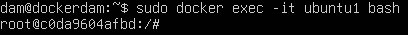

# Ejercicio 4 - Instalación de LAMP y WordPress en Contenedor Ubuntu 22.04

---

👤 **Autor:** Ana Valladares González

---

## Índice
1. [Instalación de LAMP en el Contenedor Ubuntu](#1-instalación-de-lamp-en-el-contenedor-ubuntu)
2. [Instalación de WordPress en el Contenedor](#2-instalación-de-wordpress-en-el-contenedor)
3. [Comprobación de Acceso a WordPress](#3-comprobación-de-acceso-a-wordpress)

---

### 1. Instalación de LAMP en el Contenedor Ubuntu

Para comenzar, utilizamos la imagen de **Ubuntu 22.04** y seguimos los pasos para instalar el stack **LAMP** (Linux, Apache, MySQL y PHP) dentro del contenedor.

#### 📦 Paso 1: Descargar e Inicializar la Imagen de Ubuntu 22.04

**Comandos:**
```bash
docker run -it ubuntu:22.04
apt update
```

#### 🚀 Paso 2:  Crear y Ejecutar el Contenedor de Ubuntu 22.04

Creamos un contenedor y lo dejamos en ejecución para trabajar dentro de él.

**Comandos utilizados:**
```bash
docker run -d -p 8000:80 --name ubuntu1 ubuntu:22.04 tail -f /dev/null
docker ps
```


**Ingresar al contenedor:**
```bash
docker exec -it ubuntu1 bash
```


#### 🔧 Paso 3:  Instalar LAMP (Linux, Apache, MySQL, PHP)

Procedemos a instalar LAMP *(Linux, Apache, MySQL y PHP)* en el contenedor de Ubuntu 22.04.

**Comandos utilizados:**
```bash
apt install -y apache2 apache2-utils
apt install -y mariadb-server mariadb-client
service apache2 start
apt install -y php php-mysql libapache2-mod-php
```

***⚙️ Configuración de MariaDB:***

Para configurar MariaDB, accedemos a su consola y configuramos las opciones iniciales: primero se nos pedirá la contraseña de root, la dejamos en blanco y presionamos enter, en el siguiente paso ponemos "n", luego le decimos que si a cambiar la contraseña del root y la cambiamos, y por ultimo le damos que si al resto de preguntas, además de establecer la zona horaria.

**Comandos utilizados:**
```bash
service mariadb start
mysql_secure_installation
```
--- 

### 2.  Instalación de wordpress en el contenedor.

Procedemos a instalar WordPress y sus dependencias en el contenedor de Ubuntu.

#### 📥 Paso 1: Instalación de Dependencias de WordPress

Instalamos las librerías necesarias para que WordPress funcione correctamente.

**Comandos utilizados:**
```bash
apt install ghostscript \ php-bcmath \ php-curl \ php-imagick \ php-intl \ php-json \ php-mbstring \ php-mysql \ php-xml \ php-zip
```

#### 📂  Paso 2: Crear Directorio y Descargar WordPress

Creamos un directorio para WordPress y descargamos el paquete desde su sitio oficial.

**Comandos utilizados:**
```bash
mkdir /var/www/html/wordpress
chown www-data: /srv/www
curl https://wordpress.org/latest.tar.gz | tar zx -C /srv/www
```

> **Nota:** En caso de error al descargar WordPress con wget, instálalo con el siguiente comando:
> ```bash
>   apt install wget
> ```

#### ⚙️ Paso 3: Configurar Apache para WordPress

Instalamos nano para editar el archivo de configuración de Apache y configuramos el archivo de configuración de WordPress.

**Comandos utilizados:**
```bash
apt install nano
touch /etc/apache2/sites-available/wordpress.conf
nano /etc/apache2/sites-available/wordpress.conf
```

Pegamos la siguiente configuración en el archivo de configuración de WordPress:

```bash
<VirtualHost *:80>
     ServerAdmin webmaster@localhost
     DocumentRoot /srv/www/wordpress
     ServerName wordpress.local
     ServerAlias www.wordpress.local
     <Directory /srv/www/wordpress>
         Options FollowSymLinks
         AllowOverride All
         Require all granted
     </Directory>
     ErrorLog ${APACHE_LOG_DIR}/error.log
     CustomLog ${APACHE_LOG_DIR}/access.log combined
 </VirtualHost>
```

Inicializamos el sitio de WordPress y habilitamos el sitio.

**Comandos utilizados:**
```bash
a2ensite wordpress
service apache2 reload
```

Habilitamos la URL y deshabilitamos la URL por defecto, después recargamos Apache para que surtan efecto todso los cambios realizados.

**Comandos utilizados:**
```bash
a2enmod rewrite
a2dissite 000-default
service apache2 reload
```

#### 🗄️ Paso 4: Configurar la Base de Datos de WordPress

Ingresamos a la consola de MariaDB y creamos una base de datos para WordPress.

**Comandos utilizados:**
```bash
mysql -u root -p
CREATE DATABASE wordpress;
CREATE USER '<your-user>' IDENTIFIED BY '<your-password>';
GRANT ALL PRIVILEGES ON wordpress.* TO '<your-user>';
FLUSH PRIVILEGES;
EXIT;
```

Para configurar WordPress para poder acceder a la base de datos, copiamos el archivo de configuración y lo editamos.

**Comandos utilizados:**
```bash
cp /srv/www/wordpress/wp-config-sample.php /srv/www/wordpress/wp-config.php
nano /srv/www/wordpress/wp-config.php
```

Una vez dentro del archivo, modificamos las siguientes líneas con los datos de la base de datos creada anteriormente:

```php
define('DB_NAME', 'wordpress');
define('DB_USER', '<your-user>');
define('DB_PASSWORD', '<your-password>');
define('DB_HOST', 'localhost');
define('DB_CHARSET', 'utf8');
define('DB_COLLATE', '');
```

También los datos obtenidos en la guía de instalación de WordPress, que son claves generadas aleatoriamente.


#### 🌐 Paso 5: Comprobar que WordPress funciona correctamente

Para confirmar que WordPress está correctamente instalado, abrimos un navegador y accedemos mediante la IP del contenedor seguida de /wordpress.

**Comandos utilizados:**
```bash
firefox http://192.168.0.25:8000/wp-admin/setup-config.php
```
