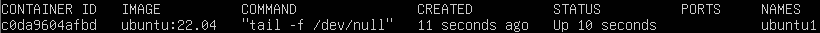
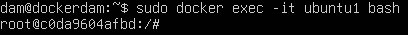

# Ejercicio 4 - Instalación de LAMP y WordPress en Contenedor Ubuntu 22.04

---

👤 **Autor:** Ana Valladares González

---

## Índice
1. [Instalación de LAMP en el Contenedor Ubuntu](#1-instalación-de-lamp-en-el-contenedor-ubuntu)
2. [Instalación de WordPress en el Contenedor](#2-instalación-de-wordpress-en-el-contenedor)
3. [Comprobación de Acceso a WordPress](#3-comprobación-de-acceso-a-wordpress)

---

### 1. Instalación de LAMP en el Contenedor Ubuntu

Para comenzar, utilizamos la imagen de **Ubuntu 22.04** y seguimos los pasos para instalar el stack **LAMP** (Linux, Apache, MySQL y PHP) dentro del contenedor.

#### 📦 Paso 1: Descargar e Inicializar la Imagen de Ubuntu 22.04

**Comandos:**
```bash
docker run -it ubuntu:22.04
apt update
```

#### 🚀 Paso 2:  Crear y Ejecutar el Contenedor de Ubuntu 22.04

Creamos un contenedor y lo dejamos en ejecución para trabajar dentro de él.

**Comandos utilizados:**
```bash
docker run -d --name ubuntu1 ubuntu:22.04 tail -f /dev/null
docker ps
```


**Ingresar al contenedor:**
```bash
docker exec -it ubuntu1 bash
```


#### 🔧 Paso 3:  Instalar LAMP (Linux, Apache, MySQL, PHP)

Procedemos a instalar LAMP *(Linux, Apache, MySQL y PHP)* en el contenedor de Ubuntu 22.04.

**Comandos utilizados:**
```bash
apt install -y apache2 apache2-utils
apt install -y mariadb-server mariadb-client
service apache2 start
apt install -y php php-mysql libapache2-mod-php
```

***⚙️ Configuración de MariaDB:***

Para configurar MariaDB, accedemos a su consola y configuramos las opciones iniciales, además de establecer la zona horaria.

**Comandos utilizados:**
```bash
service mariadb start
mysql_secure_installation
```
--- 

### 2.  Instalación de wordpress en el contenedor.

Procedemos a instalar WordPress y sus dependencias en el contenedor de Ubuntu.

#### 📥 Paso 1: Instalación de Dependencias de WordPress

Instalamos las librerías necesarias para que WordPress funcione correctamente.

**Comandos utilizados:**
```bash
apt install ghostscript \ php-bcmath \ php-curl \ php-imagick \ php-intl \ php-json \ php-mbstring \ php-mysql \ php-xml \ php-zip
```

#### 📂  Paso 2: Crear Directorio y Descargar WordPress

Creamos un directorio para WordPress y descargamos el paquete desde su sitio oficial.

**Comandos utilizados:**
```bash
mkdir /var/www/html/wordpress
wget https://wordpress.org/latest.tar.gz
```

> **Nota:** En caso de error al descargar WordPress con wget, instálalo con el siguiente comando:
> ```bash
>   apt install wget
> ```

#### 📦  Paso 3: Descomprimir y Mover WordPress al Directorio

Una vez descargado, descomprimimos WordPress y movemos el contenido al directorio de destino.

**Comandos utilizados:**
```bash
tar -xvf latest.tar.gz
mv wordpress /var/www/html/
```

---

### 3.  Comprobación de Acceso a WordPress

Para confirmar que WordPress está correctamente instalado, abrimos un navegador y accedemos mediante la IP del contenedor seguida de /wordpress.

**Comandos utilizados:**
```bash
firefox http://IP_contenedor /wordpress
```