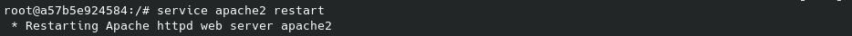

# Ejercicio 4 - Instalación de LAMP y WordPress en Contenedor Ubuntu 22.04

---

👤 **Autor:** Ana Valladares González

---

## Índice
1. [Instalación de LAMP en el Contenedor Ubuntu](#1-instalación-de-lamp-en-el-contenedor-ubuntu)
2. [Instalación de WordPress en el Contenedor](#2-instalación-de-wordpress-en-el-contenedor)
3. [Comprobación de Acceso a WordPress](#3-comprobación-de-acceso-a-wordpress)

---

### Prerrequisitos

Para realizar este ejercicio, es necesario tener instalado Docker en la máquina local. En caso de no tenerlo, se puede instalar siguiendo los pasos del siguiente enlace: [Instalación de Docker](https://docs.docker.com/engine/install/).

### 1. Instalación de LAMP en el Contenedor Ubuntu

Para comenzar, utilizamos la imagen de **Ubuntu 22.04** y seguimos los pasos para instalar el stack **LAMP** (Linux, Apache, MySQL y PHP) dentro del contenedor.

#### 📦 Paso 1: Descargar e Inicializar la Imagen de Ubuntu 22.04

**Comandos:**
```bash
docker run -it ubuntu:22.04
apt update
```

#### 🚀 Paso 2:  Crear y Ejecutar el Contenedor de Ubuntu 22.04

Creamos un contenedor con la imagen y lo arrancamos.

**Comandos utilizados:**
```bash
docker container create -i -t -p 8000:80 --name ubuntuLAMP ubuntu:22.04
docker ps
```


**Ingresar al contenedor:**
```bash
docker start --attach -i ubuntuLAMP
```


#### 🔧 Paso 3:  Instalar LAMP (Linux, Apache, MySQL, PHP)

Estando dentro del contenedor, actualizamos los paquetes y procedemos a instalar LAMP.

**Comandos utilizados:**
```bash
apt update
apt install -y apache2 apache2-utils
apt install -y mariadb-server mariadb-client
service apache2 start
mysql_secure_installation
apt install -y php php-mysql libapache2-mod-php
```


Probamos que todo esté funcionando correctamente y reiniciamos el servicio de Apache.

**Comandos utilizados:**
```bash
echo "<?php phpinfo(); ?>" | tee /var/www/html/info.php
service apache2 restart
```


Por último, accedemos al navegador para verificar:

```bash
http://10.0.9.106:8000/info.php
```


--- 

### 2.  Instalación de wordpress en el contenedor.

Procedemos a instalar WordPress y sus dependencias en el contenedor de Ubuntu.

#### 📥 Paso 1: Instalación de Dependencias de WordPress

Instalamos las librerías necesarias para que WordPress funcione correctamente.

**Comandos utilizados:**
```bash
apt install -y apache2 ghostscript libapache2-mod-php mysql-server php php-bcmath php-curl php-imagick php-intl php-json php-mbstring php-mysql php-xml php-zip 
```

#### 📂  Paso 2: Crear Directorio y Descargar WordPress

Creamos un directorio para WordPress y descargamos el paquete desde su sitio oficial (con `curl` o `wget`). 

> Nota: A la hora de hacer el `curl`, puede que se necesite instalar el paquete >`curl` con el comando `apt install curl`.

**Comandos utilizados:**
```bash
mkdir -p /srv/www
chown www-data: /srv/www
curl https://wordpress.org/latest.tar.gz | tar zx -C /srv/www
```


> **Nota:** En caso de error al descargar WordPress con wget, instálalo con el siguiente comando:
> ```bash
>   apt install wget
> ```

#### ⚙️ Paso 3: Configurar Apache para WordPress

Instalamos nano para editar el archivo de configuración de Apache y configuramos el archivo de configuración de WordPress.

**Comandos utilizados:**
```bash
apt install nano
touch /etc/apache2/sites-available/wordpress.conf
nano /etc/apache2/sites-available/wordpress.conf
```

Pegamos la siguiente configuración en el archivo de configuración de WordPress:

```bash
<VirtualHost *:80>
     ServerAdmin webmaster@localhost
     DocumentRoot /srv/www/wordpress
     ServerName wordpress.local
     ServerAlias www.wordpress.local
     <Directory /srv/www/wordpress>
         Options FollowSymLinks
         AllowOverride All
         Require all granted
     </Directory>
     ErrorLog ${APACHE_LOG_DIR}/error.log
     CustomLog ${APACHE_LOG_DIR}/access.log combined
 </VirtualHost>
```

Inicializamos el sitio de WordPress y habilitamos el sitio.

**Comandos utilizados:**
```bash
a2ensite wordpress
service apache2 reload
a2enmod rewrite
a2dissite 000-default
service apache2 restart
```


Procedemos a crear la base de datos.

**Comandos utilizados:**
```bash
mysql -u root
CREATE DATABASE wordpress;
CREATE USER 'ana' IDENTIFIED BY 'ana';
GRANT SELECT, INSERT, UPDATE, DELETE, CREATE, DROP, ALTER ON wordpress.* TO 'ana';
FLUSH PRIVILEGES;
QUIT;
```


#### 🗄️ Paso 4: Configurar la Base de Datos de WordPress

Para configurar WordPress para poder acceder a la base de datos, copiamos el archivo de configuración y lo editamos.

**Comandos utilizados:**
```bash
cp /srv/www/wordpress/wp-config-sample.php /srv/www/wordpress/wp-config.php
nano /srv/www/wordpress/wp-config.php
```

Una vez dentro del archivo, modificamos las siguientes líneas con los datos de la base de datos creada anteriormente:

```php
define('DB_NAME', 'wordpress');
define('DB_USER', '<your-user>');
define('DB_PASSWORD', '<your-password>');
define('DB_HOST', 'localhost');
define('DB_CHARSET', 'utf8');
define('DB_COLLATE', '');
```

#### 🌐 Paso 5: Comprobar que WordPress funciona correctamente

Para confirmar que WordPress está correctamente instalado, abrimos un navegador y accedemos mediante la IP del contenedor seguida de /wordpress.

**Comandos utilizados:**
```bash
firefox http://10.0.9.106:8000/wp-admin/setup-config.php
```
